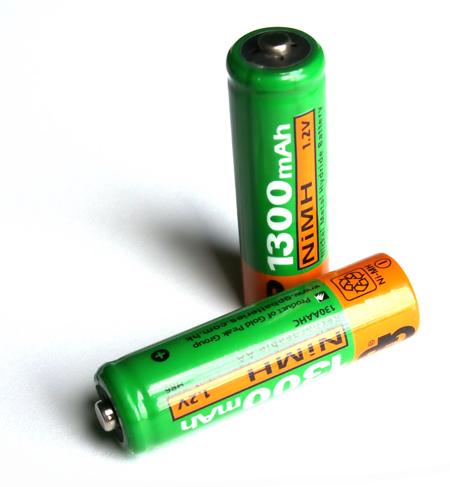

# Basic Circuits

The foundation of electronics is `circuits` which are <ins>**just a bunch of electronics parts connected with wires**</ins>.

Let's look at one of the most basic circuits in electronics:  **LED circuit**.  This circuit has **3** electronic parts:
- `LED`: emits light when electricity is applied  

- `Voltage supply`:  source of electricity, like a battery 

- `Resistor`: limits the amount of electricity that can flow  

