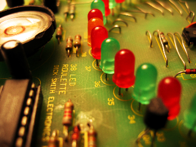
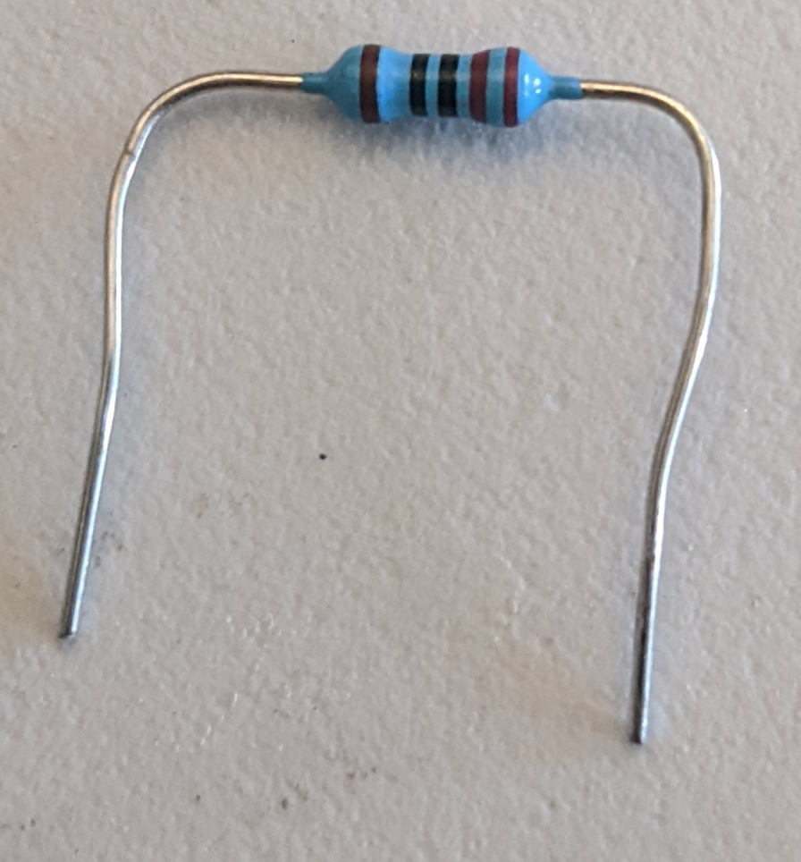

# Basic Circuits

The foundation of electronics is `circuits` which are just a bunch of electronics parts connected with wires.

Let's look at one of the most basic circuits in electronics:  an LED circuit.  We'll use **3** electronic parts for this LED circuit:
- LED: part that emits light when electricity is applied

- Resistor: part that limits the amount of electricity that can flow

- Voltage supply:  the source of electricity, this can mean anything from the power outlets in your walls to a battery