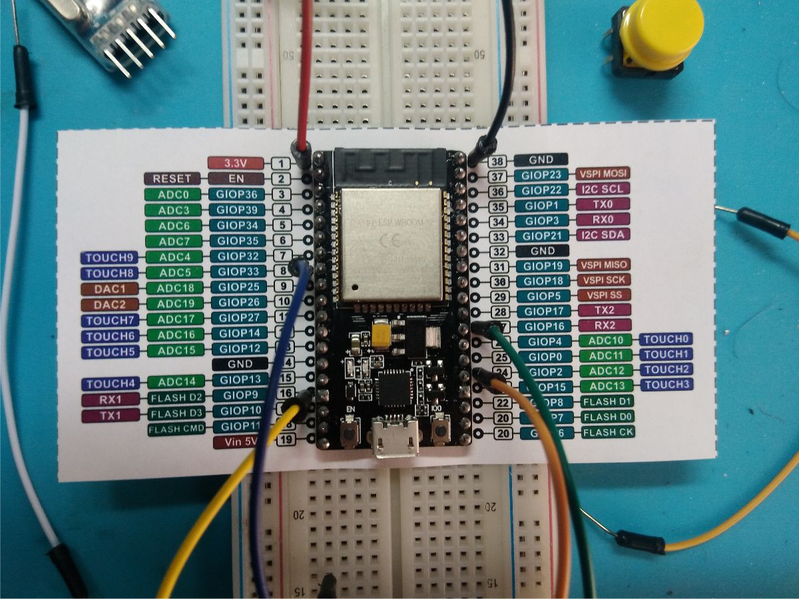

# Ideas for this class:

- TOF sensor as a novel "button" or input
- System that will take some action based on a light sensor?  Put it by a window and do something
- Teach initial programming with micro-Python
  - Move to C based programming after students are comfortable with electronics
- Use [Fritzing](https://fritzing.org/learning/tutorials/building-circuit) to make clean circuits on breadboards that students can follow
- Paper cutout that labels the pins of the dev board like this:
  - 
- Add hover-over vocab words with:
  - **<abbr title="hover-text">text</abbr>**
- Use ESP32 touch sensor pins as buttons
  - Pretty cool 
- Flash cards using Anki-droid

- We should do a bunch of mini classes
  - 1. Basics of electronics, embedded, projects, state machines, and data
    - Potentiometer lock board with "magic" dimming LED based on TOF sensor
  - 2. Class 2
    - Start logging data in FLASH memory
      - When button presses happen
- Package electronics seperately for all the labs
  - Super tedious to look through resistors for the right one